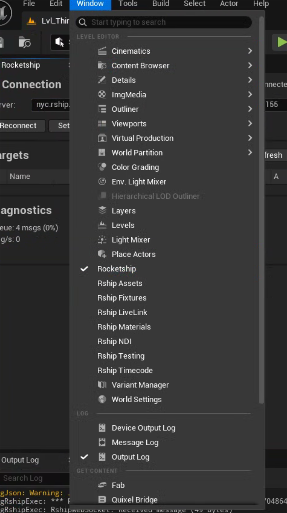
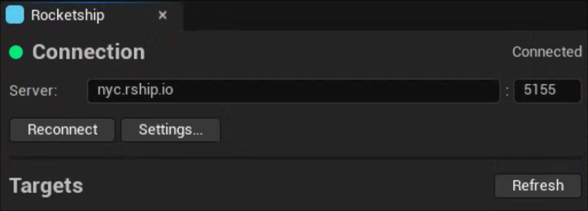
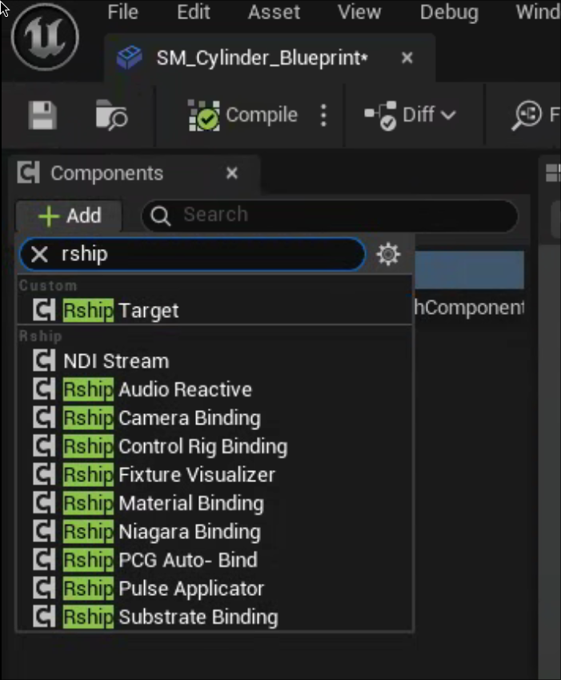
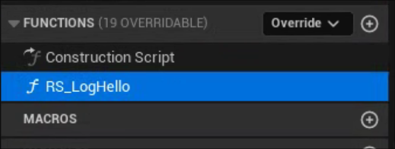
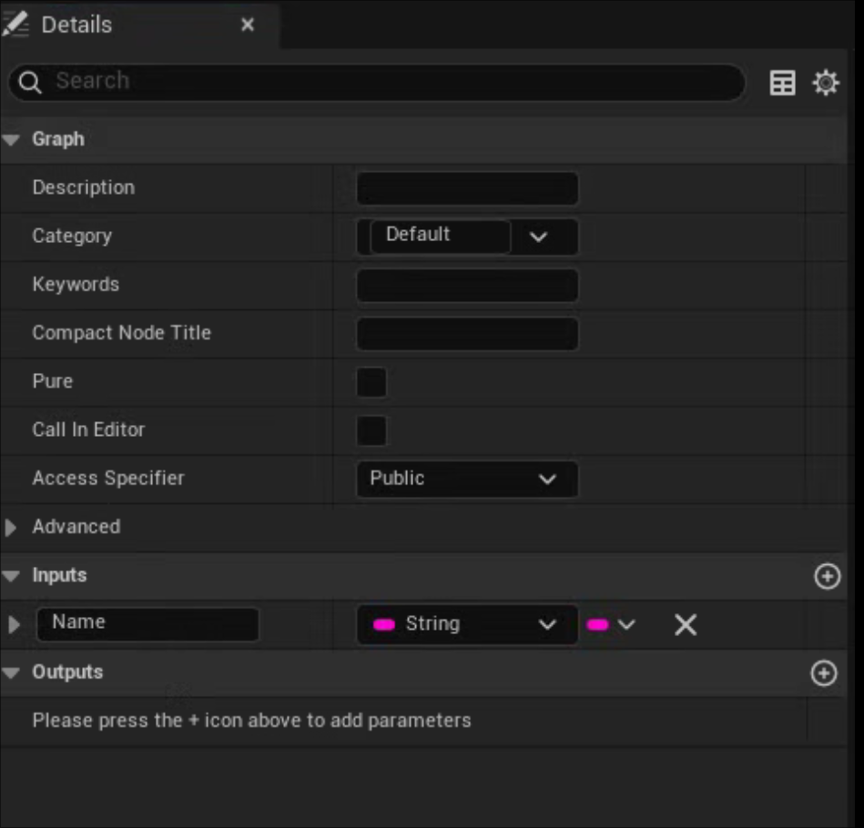
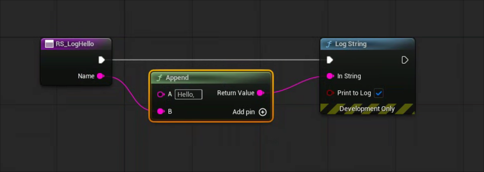
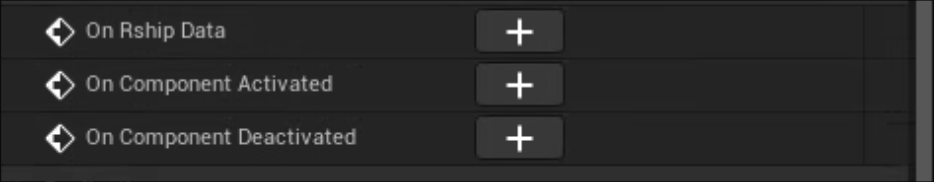
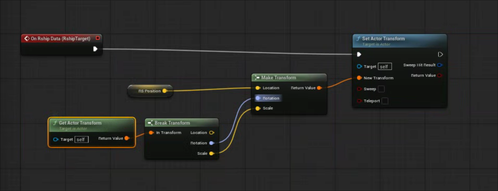

# Rship-Unreal

Unreal Engine integration for [Rocketship](https://rocketship.io) - a reactive control platform for live entertainment, broadcast, and immersive experiences.

## Plugins

| Plugin | Description | Status |
|--------|-------------|--------|
| [RshipExec](Plugins/RshipExec/README.md) | Core executor - WebSocket, targets, emitters, actions, fixtures, bindings | Stable |
| [RshipNDI](Plugins/RshipNDI/README.md) | NDI video streaming for CineCamera output | Stable |
| [Rship2110](Plugins/Rship2110/README.md) | SMPTE ST 2110 / PTP professional broadcast streaming | Beta |
| [RshipColorManagement](Plugins/RshipColorManagement/README.md) | Broadcast-grade color pipeline management | Beta |
| [RshipSpatialAudio](Plugins/RshipSpatialAudio/README.md) | Multi-channel spatial audio with VBAP/DBAP/HOA | Beta |
| [UltimateControl](Plugins/UltimateControl/README.md) | AI control - 350+ tools for Claude/LLM integration | Stable |

## Quick Start

### 1. Install Plugins

Copy the `Plugins/` folder to your UE project, or copy individual plugins you need.

### 2. Enable in Project

```json
// YourProject.uproject
{
  "Plugins": [
    { "Name": "RshipExec", "Enabled": true }
  ]
}
```

### 3. Open the Rocketship Panel

Open the Rocketship panel from **Window > Rocketship**. You'll also find specialized panels for fixtures, materials, NDI, and more.



### 4. Connect to the Server

Enter your rship server address and port, then click **Reconnect**. The status indicator turns green when connected.



### 5. Add the Target Component

Create or open a Blueprint Actor. In the Components panel, click **Add** and search for "rship" to find all available components. Add an **RshipTarget** component - this turns your Blueprint into an rship target that can be controlled remotely.



### 6. Add Variables

Variables with the `RS_` prefix automatically create both an **action** (to set the value from rship) and an **emitter** (that broadcasts when the value changes).

### 7. Add Functions

Functions with the `RS_` prefix become **actions** that rship can trigger on your target.



Add input parameters as needed - these become the action's fields in rship.



Implement your action logic in the Blueprint graph.



### 8. Handle Variable Changes (Optional)

If you need custom logic when an `RS_` variable is set from rship, use the **On Rship Data** event. This is only necessary if the variable isn't already driving behavior elsewhere in your Blueprint.

Select the RshipTarget component in the Blueprint editor outliner to find these events in the Details panel:





### 9. Press Play

Hit Play in the editor - your targets automatically register with rship and appear in the UI. Create bindings between emitters and actions to build reactive behavior.

See the [Getting Started Guide](docs/GETTING_STARTED.md) for detailed setup.

## Documentation

| Document | Description |
|----------|-------------|
| [Getting Started](docs/GETTING_STARTED.md) | New user onboarding guide |
| [Upgrade Guide](docs/UPGRADE_GUIDE.md) | Full feature reference |
| [Rate Limiting](docs/README_RATE_LIMITING.md) | Message throttling configuration |
| [Spatial Audio Architecture](docs/SPATIAL_AUDIO_ARCHITECTURE.md) | Spatial audio system design |
| [Windows Build Environment](docs/WINDOWS_BUILD_ENVIRONMENT.md) | Windows build setup |

## Features

### RshipExec (Core)
- **Target System** - Expose actors with `RS_` prefix convention
- **Fixture Control** - DMX output, GDTF/MVR import, IES profiles, beam visualization
- **Material Bindings** - Material parameters, Substrate materials, Niagara systems
- **Control Rig** - Bind Control Rig parameters for animation
- **LiveLink** - Bidirectional LiveLink subject integration
- **Timecode** - Multi-source SMPTE timecode sync
- **Sequencer Sync** - Level Sequence playback control
- **OSC Bridge** - Route OSC through rship bindings
- **PCG Auto-Bind** - Automatic binding for procedurally spawned actors
- **Recording** - Record and playback sessions

### Video Streaming
- **NDI** - Stream CineCamera views to NDI receivers
- **ST 2110** - Professional uncompressed video over IP (requires Rivermax)

### Audio
- **Spatial Audio** - 256+ speaker support, VBAP/DBAP/HOA rendering
- **External Processors** - d&b DS100 integration via OSC

### AI Control
- **UltimateControl** - 350+ methods for Claude/LLM control of the editor

## Requirements

- Unreal Engine 5.6+
- Windows or macOS
- Rocketship server for full functionality

## Console Commands

```
rship.status          # Connection status
rship.targets         # List registered targets
rship.validate        # Validate scene configuration
rship.reconnect       # Force reconnection
rship.timecode        # Timecode sync status
```

## Architecture

```
┌─────────────────────────────────────────────────────────────────┐
│                         RSHIP SERVER                            │
│   Bindings • Scenes • Calendars • Event Routing                │
└─────────────────────────────────────────────────────────────────┘
        │ Actions                                    ▲ Pulses
        ▼                                            │
┌─────────────────────────────────────────────────────────────────┐
│                      UNREAL ENGINE                              │
│                                                                 │
│  ┌─────────────┐  ┌─────────────┐  ┌─────────────┐             │
│  │ RshipExec   │  │ RshipNDI    │  │ Rship2110   │             │
│  │ Targets     │  │ NDI Streams │  │ ST 2110     │             │
│  │ Fixtures    │  └─────────────┘  └─────────────┘             │
│  │ Bindings    │                                               │
│  └─────────────┘  ┌─────────────┐  ┌─────────────┐             │
│                   │ ColorMgmt   │  │ SpatialAudio│             │
│                   │ Color Pipe  │  │ VBAP/HOA    │             │
│                   └─────────────┘  └─────────────┘             │
└─────────────────────────────────────────────────────────────────┘
```

## Support

- GitHub Issues: [github.com/ignition-is-go/rship-unreal](https://github.com/ignition-is-go/rship-unreal/issues)
- Rocketship Docs: [docs.rocketship.io](https://docs.rocketship.io)

## License

Proprietary - Contact [Lucid](https://lucid.rocks) for licensing.
