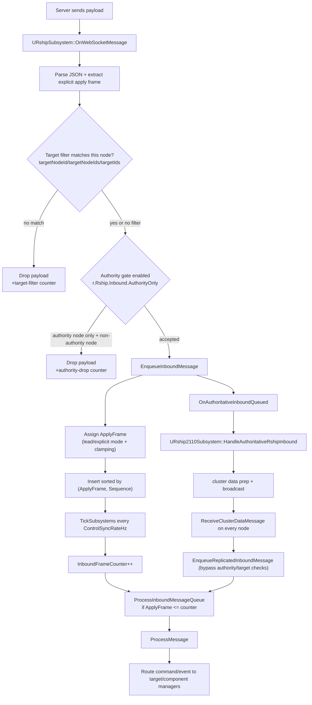

# Rship Frame-Sync and Inbound Determinism Manual

Last updated: 2026-02-14

Use this manual when you need all nodes in a multi-node rendering cluster to apply the same command/event on the same frame.

This workflow is designed to be user-facing. You do not need console commands for normal operation.

---

## 1) End-to-end data flow (server -> rendered frame)



---

## 2) What the current code guarantees

### 2.1 Frame extraction

A payload is checked for explicit frame intent in these JSON fields:

- `applyFrame`
- `targetFrame`
- `frame`
- `frameNumber`
- `frameIndex`
- `target_frame`
- `apply_frame`

The same set is checked at root, `data`, `meta`, and `meta.data`.

#### 2.1.1 Myko placement guidance

Myko is the transport, not the schema gate. These are optional fields the plugin consumes for deterministic scheduling when present.

For deterministic multi-node sync, include them in Myko payloads as non-breaking extras:

- `applyFrame` for explicit frame target (or `targetFrame`, etc.)
- `targetNodeId` / `targetNodeIds` / `targetIds` for node filtering
- `syncDomainId` (2110 path) on command/event payload root `data` (recommended) so `Rship2110Subsystem::ExtractSyncDomainIdFromPayload` can read it.

Recommended Myko-compatible shape for commands:

```json
{
  "event": "ws:m:command",
  "data": {
    "commandId": "ExecTargetAction",
    "command": {
      "tx": "tx-...",
      "action": {
        "id": "setIntensity",
        "targetId": "/stage/light1"
      },
      "data": {
        "value": 1.0
      }
    },
    "applyFrame": 120,
    "targetNodeIds": ["node_01"],
    "syncDomainId": "default"
  },
  "meta": {
    "frame": 120
  }
}
```

Recommended shape for events:

```json
{
  "event": "ws:m:event",
  "data": {
    "changeType": "SET",
    "itemType": "Fixture",
    "item": { "id": "f1", "value": 1.0 },
    "tx": "tx-...",
    "targetNodeIds": ["node_01"]
  },
  "meta": {
    "frameNumber": 120
  }
}
```

In this example, `meta` provides frame hints and `data` carries node targeting so both frame extraction and node filtering can resolve correctly.

### 2.2 Apply-frame assignment

For each enqueued payload:

1. `NextFrame = InboundFrameCounter + max(1, InboundApplyLeadFrames)`.
2. If explicit frame present: `ApplyFrame = max(ExplicitFrame, NextFrame)`.
3. If no explicit frame: `ApplyFrame = NextFrame`.
4. Queue entry stores sequence + payload + frame and keeps order by:
   - `ApplyFrame` ascending
   - sequence ascending for equal frames.
5. On each tick, entries with `ApplyFrame <= InboundFrameCounter` are processed.

Hard limit: `r.Rship.Inbound.MaxMessagesPerTick` (default `256`) controls how many queued entries are applied per tick.

### 2.3 Exact-frame policy

`r.Rship.Inbound.RequireExactFrame` and `bInboundRequireExactFrame` (UI checkbox) only affect explicit-frame messages:

- strict mode ON: explicit payloads with `ApplyFrame <= InboundFrameCounter` are dropped.
- strict mode OFF: explicit payloads behind current frame are clamped forward using `max(explicit, NextFrame)`.

This is the switch that ensures late data never lands on earlier frames when all nodes are aligned.

### 2.4 Queue capacity and drops

- Inbound queue cap is `500` entries (runtime default).
- If inbound queue is full, oldest entries are dropped and logged once per run.
- Inbound-filtered and exact-drop counters are tracked; exact-drop is shown in diagnostics.

---

## 3) Authority and cluster relay behavior

### 3.1 Raw websocket ingress policy

- `r.Rship.Inbound.AuthorityOnly` = 1 means only the authority node ingests websocket actions/events directly.
- Other nodes rely on replicated cluster payloads from the authority.

Node role resolution order:

- `dc_node=` (command line) → `RSHIP_NODE_ID` (environment)  
- `rship_authority_node=` (command line) → `RSHIP_AUTHORITY_NODE` (environment) → default `node_0`
- if local node id is empty, it inherits authority id.

### 3.2 2110 relay

On authority node, assigned inbound messages trigger:

- `OnAuthoritativeInboundQueued( payload, suggestedApplyFrame )`
- `URship2110Subsystem::HandleAuthoritativeRshipInbound`
- cluster submission (`bypass` inbound filters for replication path)
- `ReceiveClusterDataMessage` queues replicated messages by sync domain
- local apply uses the same deterministic queue on each node

This is what keeps command intent aligned across authority and non-authority nodes.

---

## 4) Runtime operator UI (no command lines required)

Open via:

- **Window > Rocketship** (tab title `Rocketship`), and
- **Play Toolbar button `Rship`**

### 4.1 Connection section

- `Server` field
- `Port` field
- `Reconnect` button
- `Settings...` button -> Project Settings > Game > Rocketship Settings
- status text and indicator

### 4.2 Sync timing section

- Presets: `30`, `60`, `120`
  - also applies `ClusterSyncRateHz` when SMPTE 2110 module is available.
- Control sync rate (Hz) + Apply
- Inbound lead frames + Apply
- Inbound require exact frame checkbox
- live summary line (`Deterministic timeline ...`)

### 4.3 Rollout actions

- `Save Timing Defaults`  
  Writes current values into runtime config for 2110 + `RshipSettings` defaults.
- `Copy Timing Profile`  
  Copies current resolved `.ini` snippet for distribution.

Example copied profile:

```ini
[/Script/RshipExec.URshipSettings]
ControlSyncRateHz=60.00
InboundApplyLeadFrames=1
bInboundRequireExactFrame=false

[/Script/Rship2110.URship2110Settings]
ClusterSyncRateHz=60.00
LocalRenderSubsteps=1
MaxSyncCatchupSteps=4
```

### 4.4 Targets section

- target list with `Target`, `Type`, `Emitters`, `Actions`
- `Refresh` button

### 4.5 Diagnostics section

- Outbound `Queue`
- Outbound `Msg/s`, `KB/s`
- Outbound dropped count
- Inbound exact dropped count
- Inbound frame
- Next planned apply
- Queued frame span (oldest..newest)
- Backoff/reconnect status

### 4.6 SMPTE 2110 section (if plugin loaded)

- status badges for Rivermax / PTP / IPMX / GPUDirect / Network
- `2110 cluster rate (Hz)`
- `Local render substeps`
- `Max catch-up steps`
- `Active sync domain` and `Sync domain rate`

`LocalRenderSubsteps` affects local render pacing only; cluster frame progression remains controlled by shared sync timing.

---

## 5) Runbook (recommended rollout sequence)

1. Configure host/port in Project Settings or via the Connection section.
2. Open Rocketship panel and set:
   - `ControlSyncRateHz` (same on all nodes)
   - `ClusterSyncRateHz` (same on all nodes when 2110 is used)
3. Set `InboundApplyLeadFrames` conservatively (start `2..4`).
4. Validate target filters / node ids in payloads.
5. Enable strict exact-frame only after node timing alignment is verified.
6. On one machine, click `Save Timing Defaults`; distribute profile text with `Copy Timing Profile`.
7. Confirm diagnostics:
   - bounded inbound queue,
   - low or stable exact-drop count when strict mode is on,
   - no sustained outbound queue pressure.
8. Adjust per-node `LocalRenderSubsteps` only for local rendering output pacing.

---

## 6) Troubleshooting (UI-first)

- Node applying earlier/later than expected:
  - verify all nodes share same `ControlSyncRateHz` and `ClusterSyncRateHz`
  - verify strict mode state
  - increase `InboundApplyLeadFrames` if jitter is high
- Target not receiving actions:
  - check payload `targetNodeId`, `targetIds`, or `targetNodeIds`
- Queue keeps growing:
  - verify nodes are connected and authority routing is correct
  - inspect frame drift (`InboundFrameCounter` vs incoming explicit frames)
- Repeated dropped/failed messages:
  - check connection health and outbound rate-limit pressure
  - check diagnostics for exact-drop count and review logs for authority-filter drops
- 2110 controls missing:
  - confirm plugin build/runtime availability and module loaded

---

## 7) Optional advanced tuning

You can still use these console variables if needed (not required for daily workflows):

- `r.Rship.Inbound.AuthorityOnly`
- `r.Rship.Inbound.RequireExactFrame`
- `r.Rship.Inbound.ApplyLeadFrames`
- `r.Rship.ControlSyncRateHz`
- `r.Rship.Inbound.MaxMessagesPerTick` (runtime override only)

The authoritative source of truth for day-to-day operation is the Rocketship panel (`Save Timing Defaults` + `Copy Timing Profile`).
